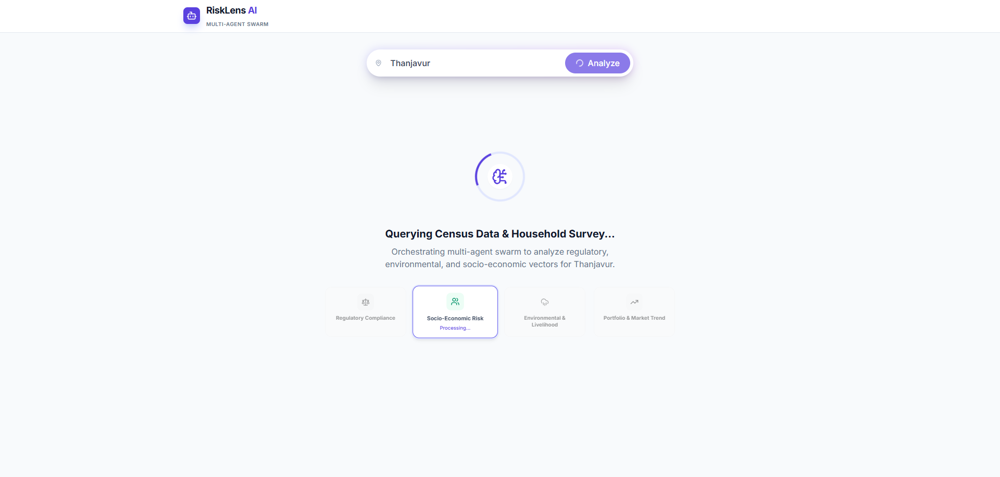
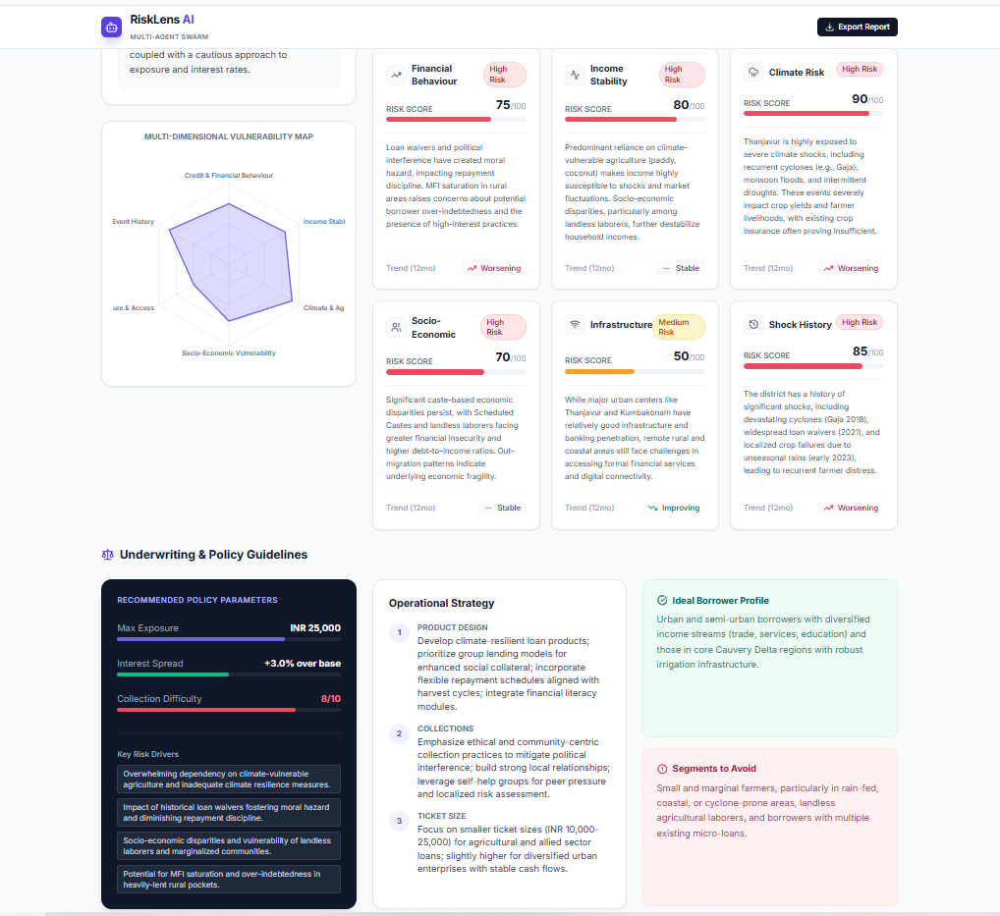
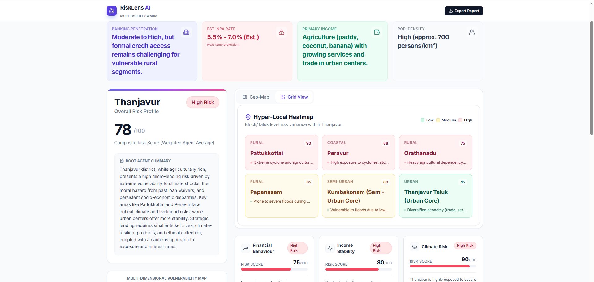

# Risklensai

Small React + TypeScript UI for visualizing risk data and integrating with a Gemini service.

## Live demo
- Public demo: https://risklens-3001.web.app/
  - This is the hosted preview of the latest build. If changes are not visible, rebuild and redeploy.

## Demo screenshots
- Home view  
  

- Graph / dashboard  
  

- Search results  
  

## Tech stack
- React + TypeScript (.tsx components in /components)
- Services: /services/geminiService.ts (calls to Gemini / LLM)
- Build tools: standard npm scripts (project may use CRA, Vite, or similar)

## Quick start (Windows)
1. Install dependencies
   - PowerShell / CMD:
     npm install

2. Set environment variables (example for Gemini API key)
   - PowerShell (current session):
     $env:REACT_APP_GEMINI_API_KEY = "your_api_key"
   - Persist (PowerShell):
     setx REACT_APP_GEMINI_API_KEY "your_api_key"

3. Run locally
   - If the project uses Vite:
     npm run dev
   - If it uses Create React App:
     npm start

4. Build for production:
   npm run build

5. Deploy (example: Firebase Hosting)
   - Install Firebase CLI (if using Firebase):
     npm install -g firebase-tools
   - Login and initialize (first time):
     firebase login
     firebase init hosting
   - Deploy:
     firebase deploy --only hosting
   - After deploy, confirm the site at the demo URL above.

6. Run tests:
   npm test

## Project structure
- /components
  - BlockHeatmap.tsx
  - DimensionCard.tsx
  - GeoMap.tsx
  - MetricCard.tsx
  - RiskBadge.tsx
  - RiskRadarChart.tsx
- /services
  - geminiService.ts — wrapper for calling the Gemini/LLM API (configure via env var)
- /img
  - hoem.png
  - graph.2.png
  - searched_result1.png

## Core idea — multi-agent risk synthesis

We run a set of specialist LLM agents (financial, income stability, climate, socio-economic, infrastructure, shock history) in parallel to fetch and structure district-level signals. An aggregator agent then synthesizes those structured outputs into a single, actionable lending risk view (JSON-like) for a given district. This makes the system:

- modular: add/remove specialist agents easily
- auditable: each dimension produces a structured output
- actionable: aggregator returns short lender-ready guidance and risk drivers

Example Python (minimal) — run a Thanjavur assessment
```python
# Minimal example: create specialists, run in parallel, synthesize
# This is a concise snippet — adapt retry/keys as needed.

from google.adk.agents import Agent, ParallelAgent, SequentialAgent
from google.adk.models.google_llm import Gemini
from google.adk.runners import InMemoryRunner
from google.adk.tools import google_search
from google.genai import types

# retry options (recommended)
retry = types.HttpRetryOptions(attempts=5, initial_delay=1, exp_base=7, http_status_codes=[429,500,503,504])

# helper to build simple specialist
def make_specialist(name, instruction, output_key):
    return Agent(
        name=name,
        model=Gemini(model="gemini-2.5-flash-lite", retry_options=retry),
        tools=[google_search],
        instruction=instruction,
        output_key=output_key,
    )

# create specialists (trimmed instructions for brevity)
financial = make_specialist("financial_risk", "Provide district-only financial risk JSON", "financial_risk")
income = make_specialist("income_stability", "Provide district-only income stability JSON", "income_stability_risk")
climate = make_specialist("climate_risk", "Provide district-only climate risk JSON", "climate_risk")
socio = make_specialist("socio_vulnerability", "Provide district-only socio-economic JSON", "socio_economic_vulnerability")
infra = make_specialist("infra_access", "Provide district-only infra JSON", "infrastructure_access_risk")
shock = make_specialist("shock_history", "Provide district-only shock history JSON", "shock_history_risk")

# aggregator expects structured outputs from all specialists and returns final JSON-like summary
aggregator = Agent(
    name="aggregator",
    model=Gemini(model="gemini-2.5-flash-lite", retry_options=retry),
    instruction="Synthesize specialists' JSON outputs into a single actionable risk view (Overall Risk Level, Key Drivers, Lending Strategy).",
    output_key="final_risk_assessment",
)

# orchestration: run specialists in parallel then aggregator
parallel_team = ParallelAgent(name="ParallelResearchTeam", sub_agents=[financial, income, climate, socio, infra, shock])
root = SequentialAgent(name="ResearchSystem", sub_agents=[parallel_team, aggregator])

runner = InMemoryRunner(agent=root)

# run and get result (async runner in notebook or async context)
response = await runner.run_debug("Provide a comprehensive micro-lending risk assessment for the district of Thanjavur in Tamil Nadu, India.")
print(response["final_risk_assessment"])
```

Expected aggregator output (JSON-like text example)
```json
{
  "District": "Thanjavur",
  "Overall Risk Level": "Medium",
  "Dimension Risk Levels": {
    "Credit & Financial Behaviour": "Medium",
    "Income Stability": "Medium",
    "Climate & Agricultural Risk": "High",
    "Socio-Economic Vulnerability": "Low",
    "Infrastructure & Access": "Low",
    "Shock & Event History": "Medium"
  },
  "Key Risk Drivers": [
    "High monsoon variability impacting paddy yields",
    "Rising microfinance penetration with flat repayment trends",
    "Good market access reduces operational collection risk"
  ],
  "Safer Borrower Segments": "Salaried workers in town and diversified farm households with irrigation.",
  "High-Risk Segments": "Small rainfed paddy farmers without irrigation and seasonal labourers.",
  "Lending Strategy Suggestions": {
    "Ticket Size Guidance": "Smaller tickets for rainfed farmers; larger for salaried urban borrowers.",
    "Product Design Notes": "Seasonal EMI schedules; crop-insurance linkage for paddy loans.",
    "Collection & Operations Notes": "Use digital collections for urban pockets; field visits for remote villages."
  },
  "Summary": "Thanjavur shows medium overall risk driven primarily by climate variability. Design smaller seasonal loans for rainfed farmers and use insurance/seasonal EMIs to reduce default risk."
}
```

Notes and recommended next steps
- Validate each specialist's instruction and output schema during development to ensure aggregator parsing is robust.
- Store agent outputs (audit log) so lenders can inspect dimension-level evidence.
- Configure API keys and retries in environment variables and secrets (do not hardcode).

## Contributing
- Create a feature branch, add tests where applicable, and open a PR with a short description of changes.

## License
- Add your license details here.